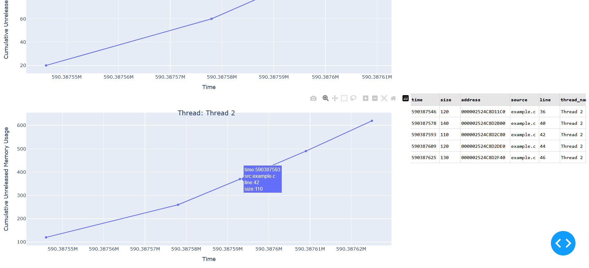

# HeapVisualizationEmbedded
HeapVisualizationEmbedded is a tool designed to analyze and visualize collected data, aiding in the identification of memory leaks in embedded C programs.

The application is specifically designed for devices that may not have the capability to run more advanced memory management tools. For example, it can be effectively utilized with semihosting, offering a practical solution for memory leak detection on resource-constrained devices.

To utilize HeapVisualizationEmbedded, you need to collect data from your embedded C project. The data collection library can be found in the related project
[MemoryLeakEmbedded](https://github.com/tymciox/MemoryLeakEmbedded)



## Preconditions
- `Python 3.12.1` or newer,
- Python library `dash` `pandas`

## Usage on a Windows:
1. Run `Windows PowerShell`,
2. Check your Python `python --version`,
3. Install necessary libraries `pip install dash pandas`,
4. Run script `python .\main.py` you should see,
```
Dash is running on http://127.0.0.1:8050/

 * Serving Flask app 'main'
 * Debug mode: on
 ```
5. Open your web browser and go to `http://127.0.0.1:8050/`,
6. Click the `Select file` button and choose your `.txt` file containing data in the specific format (refer to file `example_data.txt`)